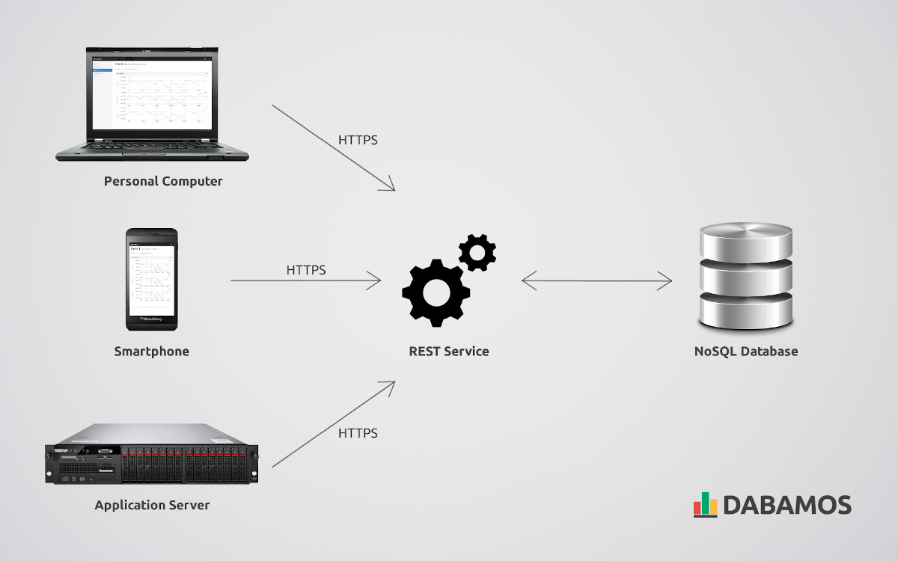

.. OpenADMS Server documentation master file, created by
   sphinx-quickstart on Thu Mar 28 10:30:17 2019.
   You can adapt this file completely to your liking, but it should at least
   contain the root `toctree` directive.

OpenADMS Server
===============

The **Open Automatic Deformation Monitoring System** (OpenADMS) is a free and
open-source software package for sensor control and observation data processing
in geodesy and geotechnics.

**OpenADMS Server** is a set of scripts and configuration files to run an HTTP
service for time series data, obtained from IoT sensor networks based on
`OpenADMS Node <https://github.com/dabamos/openadms-node/>`_ or 3rd party
applications. A REST interface API is provided for sensor data storage and
retrieval. Access the API from your web browser, with command-line tools like
`cURL <https://curl.haxx.se/>`_ or `HTTPie <https://httpie.org/>`_, or directly
from within your programming language (for instance, by using `jQuery
<https://jquery.com/>`_ or `Python Requests
<http://docs.python-requests.org/en/master/>`_).

.. _openadms_server:

   Schematic illustration of OpenADMS Server

More information is provided on the official `project website
<https://www.dabamos.de/>`_. All scripts and configuration files are hosted on
`GitHub <https://github.com/dabamos/openadms-server/>`_.

Licence
-------

This work is licenced under the `Creative Commons Attribution 3.0 Germany
<https://creativecommons.org/licenses/by/3.0/de/>`_ (CC BY 3.0 DE).

.. toctree::
   :maxdepth: 1
   :caption: Contents:

   introduction
   postgresql
   nginx
   apache-couchdb
   api
   data-retrieval

Indices and tables
==================

* :ref:`genindex`
* :ref:`search`
